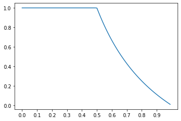

```python
import numpy as np
import matplotlib.pyplot as plt
```


```python
def rec(x, p): return 1 - p + p * x**2

def compute_rec(rec, init, args, iter):
    res = [init]
    for _ in range(iter):
        res.append(rec(res[-1], **args))

    return res
```


```python
cvg = []
interval = .01
for i, p0 in enumerate(np.arange(1e-12, 1, interval)):
    cvg.append(compute_rec(rec=rec, init=p0, args={
        "p": p0}, iter=2000)[-1])
    if not i % 10:
        print(f"p0 = {p0:.2f}\tconvergence = {cvg[-1]:.2f}\t(1 / p0 - 1) = {1 / p0 - 1:.2f}")
```

    p0 = 0.00	convergence = 1.00	(1 / p0 - 1) = 999999999999.00
    p0 = 0.10	convergence = 1.00	(1 / p0 - 1) = 9.00
    p0 = 0.20	convergence = 1.00	(1 / p0 - 1) = 4.00
    p0 = 0.30	convergence = 1.00	(1 / p0 - 1) = 2.33
    p0 = 0.40	convergence = 1.00	(1 / p0 - 1) = 1.50
    p0 = 0.50	convergence = 1.00	(1 / p0 - 1) = 1.00
    p0 = 0.60	convergence = 0.67	(1 / p0 - 1) = 0.67
    p0 = 0.70	convergence = 0.43	(1 / p0 - 1) = 0.43
    p0 = 0.80	convergence = 0.25	(1 / p0 - 1) = 0.25
    p0 = 0.90	convergence = 0.11	(1 / p0 - 1) = 0.11


```python
plt.plot(np.arange(1e-12, 1, interval), cvg)
plt.xticks(np.arange(0, 1, .1))
plt.show()
```





