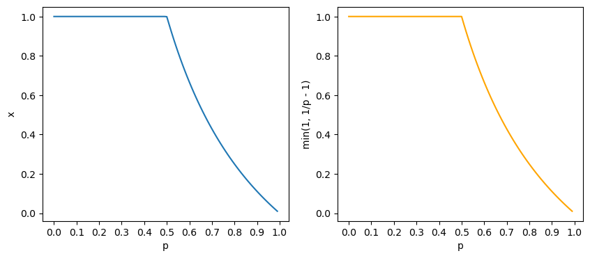

In general, a probabilistic context-free grammar (PCFG) in Chomsky normal form may be **improper**, i.e. the sum of the probability of parses successfully generated may be less than 1.

For instance, given the PCFG below:

$$
\begin{align*}
p \qquad &S \rightarrow S \ S\\
1 - p \qquad &S \rightarrow x
\end{align*}
$$

in which $S$ is the only non-terminal, $x$ is the only terminal and the probability of picking the rule $S \rightarrow S \ S$ is $p$ and $S \rightarrow x$ is $1 - p$.

Let us define $x_h$ to be the **total probability** of all parse trees with height $\leq h$. In fact, $x_h$ can be computed through a recursive equation:

$$
\begin{equation}
x_{h+1} = 1 - p + px^2_{h}
\tag{1}
\end{equation}
$$

The intuition of the recursive equation is from the fact that the set of all trees with height $\leq h + 1$, i.e. $T_{h+1}$, consists of the the base case tree $t_1$ with one single expansion $S \rightarrow x$ and all trees in the form of a root $S$ and two subtrees in $t_h \in T_h$ for all $h \geq 1$, as shown in the graph below:


```python
"""
Graphviz is a cool tool for making graphs, it is also able to produce many complex graphs like FSMs.
"""
from graphviz import Digraph

tree1 = Digraph(name="cluster0", node_attr={"shape": "plaintext"})
tree1.node("1_1", label="S")
tree1.node("1_2", label="x")
tree1.edge("1_1", "1_2")
tree1.edge_attr.update(arrowhead='none')

tree2 = Digraph(name="cluster1", node_attr={"shape": "plaintext"})
tree2.attr(color="transparent")
tree2.node("3", label="S")
tree2.node("4", label="S")
tree2.node("5", label="S")
tree2.node("6", label="x")
tree2.node("7", label="x")
tree2.edges(["34", "35", "46", "57"])
tree2.edge_attr.update(arrowhead='none')

tree3 = Digraph(name="cluster2", node_attr={"shape": "plaintext"})
tree3.attr(color="transparent")
tree3.node("3_1", label="S")
tree3.node("3_2", label="t_h")
tree3.node("3_3", label="t_h")
tree3.edge("3_1", "3_2")
tree3.edge("3_1", "3_3")
tree3.edge_attr.update(arrowhead='none')

tree1.subgraph(tree2)
tree1.subgraph(tree3)
tree1
```


In the figure above, the leftmost tree is the base case $h = 1$, and obviously $P(t_1) = x_1 = 1 - p$.

The rightmost tree is the general form of any tree $t_{h + 1}$ with $h > 1$, whose total probability is

$$
\begin{align*}
\sum_{t \in T_{h+1} - \{ t_1 \}}P(t) &= P(S \rightarrow S \ S)(\sum_{t_h \in T_h}P(t_h))^2\\
&= px^2_h
\end{align*}
$$

Hence, we arrive to the conclusion that

$$
\begin{align*}
x_{h+1} = \sum_{t \in T_{h+1}}P(t) &= P(t_1) + \sum_{t \in T_{h+1} - \{ t_1 \}}P(t)\\
&= 1 - p + px^2_{h}
\end{align*}
$$

Now let's do some basic calculus :-)

To compute the total probability of all finite-depth parse trees, we are essentially computing the limit of the recursive formula, i.e. $\displaystyle \lim_{h \rightarrow \infty}x_h$. Recall the [monotone convergence theorem](https://en.wikipedia.org/wiki/Monotone_convergence_theorem#:~:text=Informally%2C%20the%20theorems%20state%20that,will%20converge%20to%20the%20infimum.) states that

> A sequence converges if it is monotonic (increasing or decreasing) and bounded.

A review of recursive sequence can be found [here](https://www.ms.uky.edu/~droyster/ma114F16/RecursiveSequences.pdf).

Our sequence is obviously monotonically increasing by its definition, can you prove that it is bounded? A short proof is given in the appendix.

*Hint: It can be proved by induction that*

$$
\begin{equation}
0 < \lim_{h \rightarrow \infty}x_h \leq 1
\tag{2}
\end{equation}
$$

We can solve the equation below to find the limit of the sequence:

$$
\begin{align*}
\lim_{h \rightarrow \infty}x_{h+1} &= \lim_{h \rightarrow \infty} [1 - p + px^2_h]\\
x &= 1 - p + px^2
\end{align*}
$$

which has two solutions $x = 1$ or $\displaystyle x = \frac{1}{p} - 1$.

Since the sequence increases monotonically and $p \in [0, 1]$, we know that $x$ will converge to the first fix point it meets, i.e. $\displaystyle \text{min}(1, \frac{1}{p} - 1)$.

The code below verifies this conclusion.


```python
import numpy as np
import matplotlib.pyplot as plt
```


```python
def rec(x, p): return 1 - p + p * x**2

def compute_rec(rec, init, args, iter):
    res = [init]
    for _ in range(iter):
        res.append(rec(res[-1], **args))

    return res
```


```python
cvg = []
ref = []
interval = .01
for i, p0 in enumerate(np.arange(1e-12, 1, interval)):
    cvg.append(compute_rec(rec=rec, init=p0, args={
        "p": p0}, iter=2000)[-1])
    ref.append(min(1, 1 / p0 - 1))
    if not i % 10:
        print(f"p = {p0:.2f}\tconvergence = {cvg[-1]:.2f}\tmin(1, 1/p - 1) = {ref[-1]:.2f}\t(1/p - 1) = {1 / p0 - 1:.2f}")
```

    p = 0.00	convergence = 1.00	min(1, 1/p - 1) = 1.00	(1/p - 1) = 999999999999.00
    p = 0.10	convergence = 1.00	min(1, 1/p - 1) = 1.00	(1/p - 1) = 9.00
    p = 0.20	convergence = 1.00	min(1, 1/p - 1) = 1.00	(1/p - 1) = 4.00
    p = 0.30	convergence = 1.00	min(1, 1/p - 1) = 1.00	(1/p - 1) = 2.33
    p = 0.40	convergence = 1.00	min(1, 1/p - 1) = 1.00	(1/p - 1) = 1.50
    p = 0.50	convergence = 1.00	min(1, 1/p - 1) = 1.00	(1/p - 1) = 1.00
    p = 0.60	convergence = 0.67	min(1, 1/p - 1) = 0.67	(1/p - 1) = 0.67
    p = 0.70	convergence = 0.43	min(1, 1/p - 1) = 0.43	(1/p - 1) = 0.43
    p = 0.80	convergence = 0.25	min(1, 1/p - 1) = 0.25	(1/p - 1) = 0.25
    p = 0.90	convergence = 0.11	min(1, 1/p - 1) = 0.11	(1/p - 1) = 0.11


```python
fig, ax = plt.subplots(1, 2, figsize=(5 * 2, 4))
ax[0].plot(np.arange(0, 1, interval), cvg)
ax[0].set_xticks(np.arange(0, 1.1, .1))
ax[0].set_xlabel("p")
ax[0].set_ylabel('x')

ax[1].plot(np.arange(0, 1, interval), ref, color="orange")
ax[1].set_xticks(np.arange(0, 1.1, .1))
ax[1].set_xlabel("p")
ax[1].set_ylabel('min(1, 1/p - 1)')
plt.show()
```





Therefore, if $\displaystyle p > \frac{1}{2}$, we will have $\displaystyle \frac{1}{p} - 1 < 1 \Rightarrow x = \lim_{h \rightarrow \infty}x_h = \text{min}(1, \frac{1}{p} - 1) < 1$, i.e. an improper probability. This further implies that there is a non-zero probability that the PCFG does not terminate at all.

We may also interpret this phenomenon intuitively. The outcomes of the generation of this certain PCFG can be categorized into two parts, those who eventually terminate (including trees with $h = \infty$) and those who don't. It happens that when the probability of picking the rule $\displaystyle P(S \rightarrow S \ S) = p > \frac{1}{2}$, the **total** probability of running the generation process forever $> 0$, resulting in an improper distribution for the terminated parse trees.

In practice, we would like to avoid assigning such improper probability to the grammar. Fortunately, it appears that the maximum likelihood estimation (MLE) will always produce a proper distribution. A further discussion about this topic, as well as its extensions, can be found in [this paper](https://aclanthology.org/J99-1004.pdf).

## Acknowledgement
Special thanks to [Brian Lu](mailto:zlu39@jhu.edu) for his support for this blog post.

## Reference

Chi, Zhiyi. “Statistical Properties of Probabilistic Context-Free Grammars.” Comput. Linguistics 25 (1999): 131-160.

## Appendix

### Proof of Sequence Bound

This can be proved by induction.

Base case: $0 < x_1 = 1 - p \leq 1$.

Induction Hypothesis: $0 < x_k \leq 1$ for $k \geq 1$.

Proof of Induction:

$$
\begin{align*}
0 < &x_k \leq 1\\
0 < &x^2_k \leq 1\\
0 < &px^2_k \leq p\\
0 \leq 1 - p < &1 - p + x^2_k \leq 1 - p + p\\
0 < &x_{h+1} \leq 1
\end{align*}
$$

Thus, the equation $0 < \displaystyle \lim_{h \rightarrow \infty}x_h \leq 1$ if proved.
